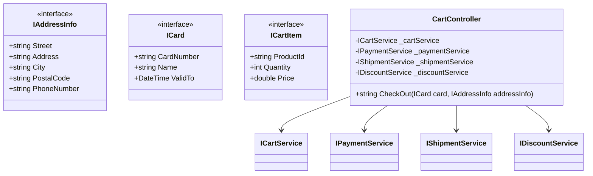

# Diagrama de Clases - EcommerceApp

```mermaid
classDiagram

    %% Interfaces
    class IAddressInfo {
        <<interface>>
        +string Street
        +string Address
        +string City
        +string PostalCode
        +string PhoneNumber
    }

    class ICard {
        <<interface>>
        +string CardNumber
        +string Name
        +DateTime ValidTo
    }
    class ICartItem {
        <<interface>>
        +string ProductId 
        +int Quantity 
        +double Price
    }

    %% Controlador
    class CartController {
        -ICartService _cartService
        -IPaymentService _paymentService
        -IShipmentService _shipmentService
        -IDiscountService _discountService
        +string CheckOut(ICard card, IAddressInfo addressInfo)
    }

    %% Relaciones
    CartController --> ICartService
    CartController --> IPaymentService
    CartController --> IShipmentService
    CartController --> IDiscountService
```
